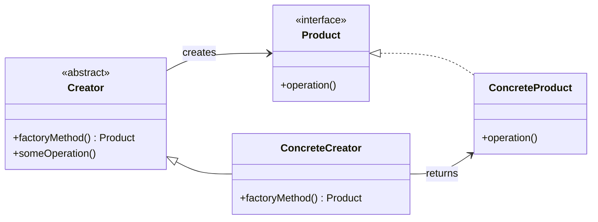

---
# 文章标题
title: 2.1 工厂方法模式
# 文章内容摘要
# description: 本文详细介绍了 Git 这一分布式版本控制系统的优点，对比了 Windows 与 macOS/Linux 系统下的常用命令，讲解了 vim 操作模式及常用命令，还阐述了 Git 的基本配置、特定项目配置和命令缩写设置等内容。
# 文章内容关键字
keywords: 工厂方法模式, 工厂方法设计模式, 创建型设计模式, 工厂方法定义, 工厂方法结构, 工厂方法产品接口, 工厂方法创建者, 工厂方法具体创建者, 工厂方法实现, 工厂方法优缺点, 工厂方法应用场景, 工厂方法示例, 工厂方法解耦, 工厂方法扩展性, 工厂方法对象创建, 工厂方法业务逻辑分离, 工厂方法对象复用, 工厂方法对象池, 工厂方法框架扩展, 工厂方法与构造函数区别
# 发表日期
date: 2025-11-01
summary: 本节详细介绍了工厂方法模式，包括其定义、解决方案、模式结构、细节说明、适合应用场景、实现方式以及优缺点等内容。
# 分类
categories:
  - 设计模式
# 标签
tags:
  - 设计模式
---

## 定义

工厂方法模式是一种**创建型设计模式**，其在父类中提供一个创建对象的方法，允许子类决定实例化对象的类型。

## 解决方案

使用**特殊的工厂方法**代替直接调用构造函数（`new` 运算符）。

工厂方法内部仍使用 `new` 运算符创建对象，返回的对象被称为 **“产品”**。

可以在**子类中重写工厂方法**，以改变其创建产品的类型。

所有产品必须具有**共同的基类或接口**。

**客户端代码**只与抽象的产品接口交互，不关心具体实现。

## 模式结构

产品接口：定义所有产品的通用接口，所有由创建者及其子类构建的对象都遵循此接口。

具体产品：是产品接口的不同实现。

创建者：

- 声明返回产品对象的**工厂方法**，工厂方法返回的对象类型必须与产品接口一致。
- 工厂方法可以是**抽象方法**或具有**默认实现**。
- 创建者包含**与产品相关的核心业务逻辑**，工厂方法将具体实例化和逻辑处理分离开来。

具体创建者：

- 重写基础工厂方法，返回不同类型的产品。
- 工厂方法可返回**缓存对象、对象池或已有对象**，而不一定创建新实例。

## 细节说明

创建者类声明的工厂方法必须返回一个产品对象，创建者子类提供该方法的具体实现。

创建者可以提供工厂方法的**默认实现**。

创建者主要负责核心业务逻辑，产品由工厂方法生成，通过重写工厂方法可**间接修改业务逻辑**。

程序根据配置或环境选择创建者类型。

客户端只通过**创建者的基本接口**交互，不依赖具体实现。

## 适合应用场景

- 无法预知对象类型时

当无法预知需要创建的对象类别及其依赖关系时，可使用工厂方法，工厂方法将产品创建与使用代码分离，便于扩展。

- 软件库或框架可扩展性

当希望用户扩展框架的内部组件时，可通过重写工厂方法实现。

- 对象复用以节省资源

在需要**复用大型资源密集型对象**（如数据库连接、文件系统、网络资源）时，可使用工厂方法。

对象复用过程：

1. 创建存储空间保存已创建对象。
2. 请求对象时，在对象池中查找可用对象。
3. 若存在可用对象，直接返回；若无则创建新对象并加入对象池。
4. 工厂方法统一管理该逻辑，避免重复代码。

## 实现方式

1. **定义产品接口：**
   所有产品必须实现此接口，并声明通用方法。
2. **添加工厂方法：**
   在创建类中添加一个空的工厂方法，返回类型遵循产品接口。
3. **替换构造函数调用：**
   将类中直接使用 `new` 的地方替换为工厂方法的调用，并将对象创建逻辑移入工厂方法中。
4. **为每种产品创建子类：**
   每个子类重写工厂方法，返回对应产品类型。
5. **优化结构：**

- 若产品类型过多，可在子类中复用基类参数控制创建逻辑。
- 若基类工厂方法无具体逻辑，可改为**抽象类**；否则保留为**默认实现**。

## 优缺点

优点：

**避免紧密耦合：** 创建者与具体产品解耦。

**单一职责原则：** 产品创建逻辑集中，便于维护。

**开闭原则：** 可在不修改客户端代码的情况下扩展新产品。

缺点：

**类数量增加：** 引入多个子类可能使代码结构更复杂，佳做法是在现有创建者类层次中引入。
