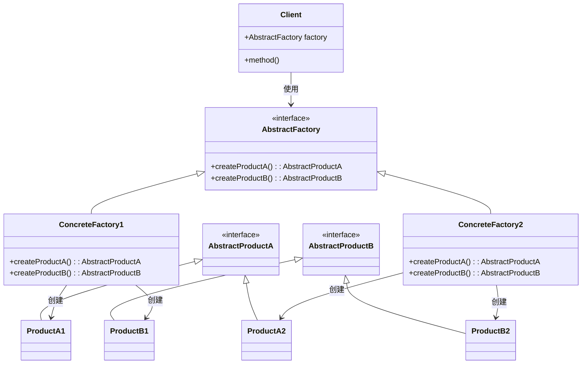

---
# 文章标题
title: 2.2 抽象工厂模式
# 文章内容摘要
# description: 本文详细介绍了 Git 这一分布式版本控制系统的优点，对比了 Windows 与 macOS/Linux 系统下的常用命令，讲解了 vim 操作模式及常用命令，还阐述了 Git 的基本配置、特定项目配置和命令缩写设置等内容。
# 文章内容关键字
keywords: 抽象工厂模式, 抽象工厂设计模式, 创建型设计模式, 抽象工厂定义, 抽象工厂结构, 抽象产品, 产品变体, 抽象工厂接口, 具体工厂, 系列产品创建, 抽象工厂实现方式, 抽象工厂应用场景, 抽象工厂优缺点, 产品族, 产品系列一致性, 工厂与产品解耦, 抽象工厂示例, 抽象工厂使用场景, 抽象工厂模式类图, 软件设计模式抽象工厂
# 发表日期
date: 2025-11-01
summary: 本节详细介绍了抽象工厂模式，包括其定义、解决方案、模式结构、细节说明等内容。
# 分类
categories:
  - 设计模式
# 标签
tags:
  - 设计模式
---

## 定义

**抽象工厂模式** 是一种**创建型设计模式**，它能**创建一系列相关的对象**，而无需指定其具体类。

## 解决方案

为系列中的每件产品**明确声明接口**，并确保所有产品变体都继承这些接口。

声明**抽象工厂接口**，其中包含系列中所有产品的构造方法，这些方法必须返回**抽象产品类型**。

对于系列产品的每个变体，基于抽象工厂接口**创建不同的工厂类**，每个工厂类只能返回特定类别的产品。

客户端代码通过抽象接口调用工厂和产品类。无需修改客户端代码，就能更改传递的工厂类或产品变体。

一般情况下，应用程序会在**初始化阶段**创建具体工厂对象。程序需根据配置文件或环境设定选择工厂类别。

## 模式结构

**抽象产品**：为构成系列产品的一组不同但相关的产品声明接口。

**具体产品**：是抽象产品的不同实现。所有变体都必须实现相应的抽象产品。

**抽象工厂**：声明创建各种抽象产品的方法。

**具体工厂**：实现抽象工厂的构建方法，每个具体工厂对应特定产品变体，且仅创建此种变体。

**关键特性：**

- 具体工厂构建方法的签名必须返回抽象产品类型。
- 客户端（Client）只通过抽象接口与工厂和产品交互。
- 客户端代码不与任何具体产品变体耦合。

## 细节说明

抽象工厂接口声明一组方法，用于返回不同抽象产品。这些产品属于同一个系列，且在概念上相关联。

同系列产品可相互搭配使用。不同变体的产品不能混用。

具体工厂创建属于同一变体的系列产品，并确保它们能搭配使用。

每个具体工厂中包含一个相应的产品变体。

系列产品中的特定产品必须有一个**基础接口**，所有产品变体都实现该接口。

客户端代码仅通过**抽象类型**使用工厂和产品。

程序根据**配置或环境设定**选择工厂类型，并在运行时创建工厂（通常在初始化阶段）。

## 适合应用场景

当代码需要与**多个不同系列的相关产品交互**，但无法提前确定具体类时，可使用抽象工厂。抽象工厂能保证创建的对象始终属于**同一系列**。

当一个类包含多个抽象方法，导致其主要功能不明确时，可将其工厂逻辑**提取为独立的抽象工厂类**。每个类仅负责单一职责，提升设计清晰度。

## 实现方式

1. 以产品类型与变体为维度绘制矩阵。
2. 为所有产品声明抽象产品接口，并让具体产品实现这些接口。
3. 声明抽象工厂接口，提供创建所有抽象产品的方法。
4. 为每种产品变体实现一个具体工厂类。
5. 在应用程序中编写初始化代码：
   - 根据配置或环境选择并实例化具体工厂类；
   - 将工厂对象传递给需要创建产品的类。
6. 将代码中所有对产品构造函数的直接调用，替换为工厂对象的构建方法。

## 优缺点

优点

- **确保同一工厂生成的产品相互匹配。**
- **避免客户端与具体产品的耦合。**
- **单一职责原则**：产品生成代码集中在一处，便于维护。
- **开闭原则**：可引入新产品变体而无需修改客户端代码。

缺点

- 引入大量接口和类，**增加系统复杂度**。
