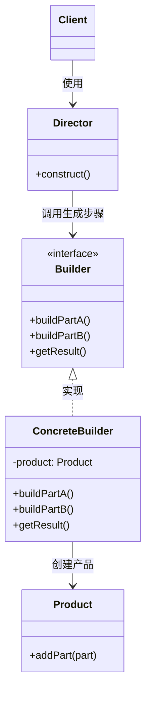

---
# 文章标题
title: 2.3 生成器模式
# 文章内容摘要
# description: 本文详细介绍了 Git 这一分布式版本控制系统的优点，对比了 Windows 与 macOS/Linux 系统下的常用命令，讲解了 vim 操作模式及常用命令，还阐述了 Git 的基本配置、特定项目配置和命令缩写设置等内容。
# 文章内容关键字
keywords: 生成器模式, Builder 模式, 创建型设计模式, 分步构建对象, 复杂对象创建, 生成器与主管, Builder 接口, 具体生成器, 对象构建步骤, 构造复杂对象, 产品构建流程, 主管类 Director, Builder 模式结构, Builder 模式实现方式, Builder 模式应用场景, 避免重叠构造函数, 不同形式产品构建, 可选参数对象创建, Builder 模式优缺点, 设计模式生成器
# 发表日期
date: 2025-11-02
summary: 本节详细介绍了生成器模式，包括其定义、解决方案、模式结构、细节说明、适合应用场景、实现方法、优缺点等内容。
# 分类
categories:
  - 设计模式
# 标签
tags:
  - 设计模式
---

## 定义

**生成器模式** 是一种创建型设计模式，使你能够**分步骤创建复杂对象**。该模式允许你使用相同的创建代码生成不同类型和形式的对象。

## 解决方案

生成器模式的核心思想：

- 将对象构造代码从产品类中抽取出来，放入独立的 **生成器对象** 中。
- 将对象构造过程划分为一组**步骤**，在创建对象时，仅需执行生成所需的步骤。

当需要创建不同形式的产品时：

- 某些构造步骤可能需要不同实现；
- 可以创建多个不同的生成器，用不同方式实现相同步骤；
- 通过调用不同的生成器步骤生成不同类型的对象。

### 主管

- 主管类定义产品的创建顺序，生成器提供创建步骤的实现；
- 客户端可将生成器传递给主管，由主管完成产品构造；
- 主管类并非必须，但能复用通用构造流程；
- 主管对客户端隐藏产品构造细节。

## 模式结构

**生成器**：声明所有生成器通用的产品构造步骤。

**具体生成器**：提供构造过程的不同实现。

**产品**：最终生成的对象，不必遵循统一接口。

**主管**：定义构造步骤的执行顺序。

**客户端**：负责将生成器与主管关联，通过主管构造产品，从生成器获取最终结果。

## 细节说明

生成器模式仅在产品**复杂且需详细配置**时有意义。

生成器接口声明产品的构造步骤，具体生成器实现这些步骤，并维护一个空产品实例。

所有生成步骤操作同一个产品实例。

具体生成器需自行提供**获取结果的方法**。

生成器可在 `getProduct()` 方法末尾重置状态（可选）。

生成器允许创建**不同接口的产品**。

主管只负责**执行顺序**，客户端可绕过主管直接调用生成器。

客户端创建生成器并传递给主管，最终结果从生成器获取。

主管不依赖具体产品或生成器。

## 适合应用场景

- **避免重叠构造函数**：

  当构造函数可选参数众多时，可通过生成器分步创建对象，无需使用多个重载构造函数。

- **创建不同形式的产品（如不同材质或样式）**：

  各种产品制造过程相似，仅有具体生成器实现细节差异；主管负责步骤顺序。

- **构造组合树或复杂对象**：

  可延迟或递归执行步骤，避免客户端获取不完整的产品。

## 实现方法

1. 明确通用步骤，确保可制造所有形式产品。
2. 在基本生成器接口中声明这些步骤。
3. 为每种产品形式创建具体生成器并实现步骤。

   若产品有统一父类，可在接口中声明 `getProduct()`。

4. 可创建主管类，封装多种产品构造方式。
5. 客户端创建生成器与主管并建立关联。

   客户端可在主管构造函数或方法中传入生成器。

6. 若所有产品有共同接口，可通过主管直接获取结果；
   否则客户端应通过生成器获取。

## 优缺点

**优点：**

- 可**分步创建对象**，并可延迟或递归执行步骤；
- 可**复用相同构造代码**以生成不同产品；
- **单一职责原则**：将复杂构造逻辑从产品业务逻辑中分离。

**缺点：**增加代码复杂度，需要引入多个类（生成器、主管等）
